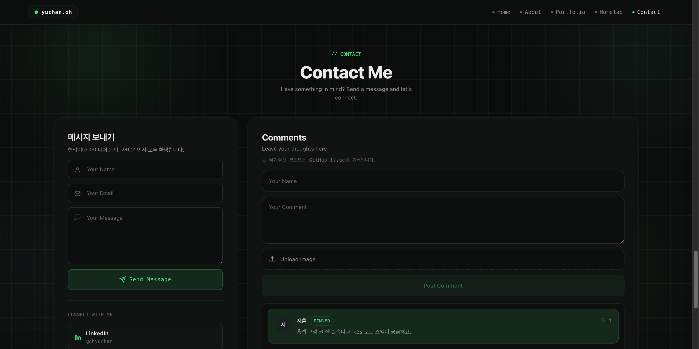
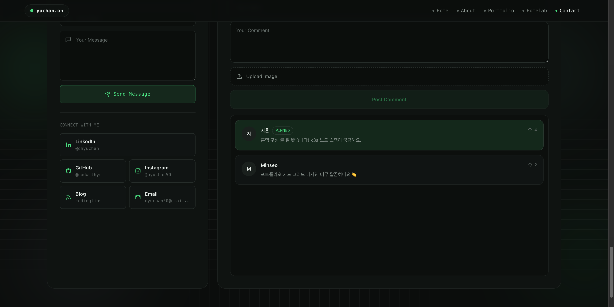

# hompage-comments

[yule.studio](https://github.com/yule-studio/hompage) 의 백엔드 모노레포. 서비스 두 개가 `apps/` 아래에 있다.

| 서비스 | 하는 일 | 포트 |
|---|---|---|
| **comment-api** | 방문자 코멘트를 이 저장소의 GitHub Issue 로 기록 | `8080` |
| **resume-api** | 이력서를 **개인정보 마스킹 후** 발급하고 누가 받아갔는지 기록 | `8081` |

```
방문자 ──▶ hompage (Vite/React) ──┬──▶ comment-api ──▶ GitHub Issues
                                  │      토큰 보관      yule-studio/hompage-comments
                                  │
                                  └──▶ resume-api  ──▶ 마스킹된 PDF + SQLite 발급 대장
```

토큰도 원본 이력서도 서버에만 존재한다. 브라우저에는 절대 내려가지 않는다.

---

## 왜 이렇게 만들었나

| | |
|---|---|
| **DB 없음** | 개인 사이트의 코멘트 몇십 건에 DB 를 띄우고 백업할 이유가 없다. |
| **알림 공짜** | 이슈가 열리면 GitHub 가 알아서 메일/모바일 알림을 보낸다. |
| **관리 공짜** | 스팸은 이슈를 닫으면 사라지고, 좋은 코멘트는 `pinned` 라벨로 맨 위에 고정된다. |
| **이력 보존** | 수정·삭제가 전부 이슈 히스토리에 남는다. |

---

## 화면

### 코멘트 월 (hompage `/#contact`)



왼쪽은 메일 폼, 오른쪽이 이 서비스가 채우는 코멘트 월이다.
이름 · 코멘트 · 이미지 첨부를 받아 `Post Comment` 로 등록한다.

### 코멘트 목록



`pinned` 라벨이 붙은 코멘트는 초록 배경으로 맨 위에 고정된다. 하트를 누르면 좋아요가 오른다.

> 위 화면의 코멘트는 문서용 **샘플 데이터**다.

---

## 이슈로 어떻게 저장되나

| 코멘트 | GitHub Issue |
|---|---|
| 이름 | 이슈 제목 |
| 본문 | 이슈 본문 |
| 첨부 이미지 | `assets/comments/{uuid}.jpg` 로 커밋 후 본문에 마크다운 삽입 |
| 좋아요 | 본문 끝의 `<!-- meta:likes=N -->` (렌더링되지 않음) |
| 고정 | `pinned` 라벨 |
| 숨김 | 이슈를 닫으면 목록에서 사라짐 |

GitHub API 에는 이슈 첨부파일 업로드가 없다 (웹 UI 의 드래그&드롭은 비공개 엔드포인트다). 그래서 이미지는 저장소에 **커밋**해서 raw URL 을 얻는 방식을 쓴다.

좋아요를 리액션으로 두지 않은 이유도 같은 맥락이다 — 모든 방문자가 서비스의 토큰 하나를 공유하므로 GitHub 가 리액션을 한 개로 합쳐버린다. 그래서 카운터를 본문에 적고 갱신한다.

---

## API

베이스 URL 은 배포 위치. 아래는 로컬 기준.

### `GET /api/comments`

열려 있는 이슈를 최신순으로 반환한다 (`pinned` 우선, 최대 100건).

```json
[
  {
    "id": 12,
    "name": "지훈",
    "comment": "홈랩 구성 글 잘 봤습니다!",
    "imageUrl": null,
    "likes": 4,
    "pinned": true,
    "createdAt": "2026-08-12T02:10:00Z",
    "issueUrl": "https://github.com/yule-studio/hompage-comments/issues/12"
  }
]
```

### `POST /api/comments`

```json
{
  "name": "지훈",
  "comment": "홈랩 구성 글 잘 봤습니다!",
  "image": "data:image/jpeg;base64,..."
}
```

`name` 40자, `comment` 2000자 제한. `image` 는 선택이며 브라우저에서 720px / JPEG 0.7 로 줄여서 보낸다. → `201 Created` + 생성된 코멘트.

### `POST /api/comments/{id}/like`

좋아요 +1. → 갱신된 코멘트.

### 응답 코드

| 코드 | 뜻 |
|---|---|
| `400` | 첨부 이미지가 PNG/JPEG 가 아니거나 1.5MB 초과 |
| `404` | 코멘트가 아닌 이슈 번호 |
| `429` | 레이트 리밋 (IP 당 10분에 5회) |
| `503` | `GITHUB_TOKEN` 미설정 |

---

## resume-api — 마스킹된 이력서 발급

이력서를 그냥 정적 파일로 올려두면 전화번호가 크롤러까지 포함해 누구에게나 열린다. 그렇다고 연락처를 다 지우면 이력서 구실을 못 한다.

그래서 이 서비스는 **받는 사람을 먼저 기록하고, 그 사람 몫의 사본을 그 자리에서 만들어서** 내보낸다.

```
POST /api/resume/download        원본 이력서 (서버에만 존재)
  { name, email, org, purpose }        │
        │                              ▼
        ├─▶ SQLite 에 행 추가 → 일련번호 #12
        │                              │
        └─▶ 전화번호 위치 탐색 ─▶ 페이지 래스터화 ─▶ 검은 박스 + "발급 #12" 스탬프
                                       │
                                       ▼
                              방문자에게 내려가는 PDF
```

### 검은 박스만 그리면 마스킹이 아니다

PDF 위에 사각형을 덮어도 **글자는 콘텐츠 스트림에 그대로 남는다.** 복사·붙여넣기나 `pdftotext` 한 번이면 전화번호가 그대로 나온다. 문서 유출 사고의 단골 원인이다.

그래서 `PdfMasker` 는 페이지를 **이미지로 다시 그린 뒤** 그 위에 박스를 얹고, 그 이미지를 페이지로 삼는다. 지워진 것이 지워진 이유는 덮어서가 아니라 **텍스트 레이어가 아예 없어서**다.

```bash
$ pdftotext 원본.pdf - | grep -c 2483
1
$ pdftotext 발급본.pdf - | grep -c 2483
0        # 텍스트 레이어 자체가 없다
```

대가도 분명하다 — 내려가는 파일은 **텍스트 선택이 안 된다.** 신원을 밝힌 사람에게 주는 이력서라면 그쪽이 맞는 거래라고 봤다.

### 무엇을 가리나

기본값은 **전화번호만**이다. 이메일은 남긴다 — 연락이 안 되는 이력서는 쓸모가 없고, 주소는 이미 사이트에 공개되어 있다.

정규식은 한국 휴대폰·유선번호의 두 가지 형태(`010-2483-0509`, `+82 10-2483-0509`)를 잡되, 이력서를 채우는 숫자들(`1,000 ~ 2,000건`, `2025.05.13`, `10 ~ 15분`)에는 걸리지 않도록 앞자리 `0` 과 뒷자리 4개에 앵커를 걸었다. 더 가리려면 `RESUME_MASK_PATTERNS` 에 정규식을 추가한다.

**매칭이 0건이면 발급을 거부한다** (`500`). 이력서 서식이 바뀌어 패턴이 안 먹으면 전화번호가 그대로 나가버리는데, 이 엔드포인트의 존재 이유가 마스킹이므로 조용히 통과시키지 않는다.

### 일련번호가 핵심이다

발급본 하단에 `발급 #12 · 2026-08-14 · 홍길동` 이 찍힌다. 이력서가 엉뚱한 곳에서 발견되면 **대장의 한 행으로 정확히 좁혀진다.** 문서를 주기 전에 이름을 묻는 이유가 이것 하나다.

`autoincrement` 라 행을 지워도 번호는 재사용되지 않는다.

### API

#### `POST /api/resume/download`

```json
{
  "name": "김채용",
  "email": "recruit@acme.com",
  "org": "ACME",
  "purpose": "백엔드 채용 검토"
}
```

→ `200 OK` · `application/pdf` · 헤더 `X-Resume-Serial: 12`

`name` · `email` 필수, `org` · `purpose` 선택. 입력값은 **검증하지 않는다** — 아무 이름이나 적을 수 있다. 인증이 아니라 과속방지턱 + 기록이다.

#### `GET /api/resume/downloads`

발급 대장. `X-Admin-Token` 헤더가 `ADMIN_TOKEN` 과 일치해야 한다. `ADMIN_TOKEN` 이 비어 있으면 라우트 자체가 `404` 다.

```json
[{ "serial": 12, "name": "김채용", "email": "recruit@acme.com",
   "org": "ACME", "purpose": "백엔드 채용 검토", "createdAt": "2026-08-14T07:36:46Z" }]
```

#### 응답 코드

| 코드 | 뜻 |
|---|---|
| `400` | 이름 누락 또는 이메일 형식 오류 |
| `401` | `X-Admin-Token` 불일치 |
| `404` | `ADMIN_TOKEN` 미설정 (대장 비활성) |
| `429` | 레이트 리밋 (IP 당 10분에 3회 — 발급 1회가 전 페이지 렌더링이다) |
| `500` | 마스킹 대상을 하나도 찾지 못함 |
| `503` | `RESUME_SOURCE` 미설정 |

### ⚠️ 원본을 공개 경로에서 치워야 한다

이 서비스는 **원본이 다른 곳에서 받아지지 않을 때만** 의미가 있다. `hompage/public/docs/resume.pdf` 처럼 정적으로 서빙되는 자리에 원본이 남아 있으면 마스킹은 장식이다.

- 원본은 배포되지 않는 경로에 두고 `RESUME_SOURCE` 로 절대경로를 지정한다
- 한 번이라도 git 에 커밋했다면 **히스토리에서도 지워야 한다** — 워킹 트리에서 지우는 것만으로는 이전 커밋에서 그대로 받아진다

---

## 설정

### 1. 토큰 발급

[Fine-grained personal access token](https://github.com/settings/tokens?type=beta) 을 **이 저장소에만** 스코프해서 만든다.

| 권한 | 용도 |
|---|---|
| Issues: **Read and write** | 코멘트 등록 · 조회 · 좋아요 |
| Contents: **Read and write** | 이미지 첨부 (안 쓰면 생략 가능) |

### 2. 환경변수

```bash
cp .env.example .env
# .env 를 열어 GITHUB_TOKEN 을 채운다 — .env 는 gitignore 되어 있다
```

| 변수 | 기본값 | 설명 |
|---|---|---|
| `GITHUB_TOKEN` | — | **필수.** 없으면 API 가 503 을 반환한다 |
| `GITHUB_OWNER` | `yule-studio` | 이슈가 열릴 소유자 |
| `GITHUB_REPO` | `hompage-comments` | 이슈가 열릴 저장소 |
| `GITHUB_BRANCH` | `main` | 이미지가 커밋될 브랜치 |
| `GITHUB_ATTACHMENTS` | `true` | 이미지 첨부 사용 여부 |
| `ALLOWED_ORIGINS` | `http://localhost:5273,http://localhost:5173` | CORS 허용 오리진 (쉼표 구분) |
| `TRUST_PROXY` | `false` | `X-Forwarded-For` 신뢰 여부. **프록시 뒤에 있을 때만** `true` |
| `PORT` | `8080` | comment-api 포트 |

resume-api 쪽:

| 변수 | 기본값 | 설명 |
|---|---|---|
| `RESUME_SOURCE` | — | **필수.** 원본 이력서 절대경로. 없으면 503. **공개 경로에 두지 말 것** |
| `RESUME_FILENAME` | `오유찬_이력서.pdf` | 브라우저가 저장할 파일명 |
| `RESUME_DB` | `./data/resume.db` | 발급 대장 SQLite 파일 |
| `RESUME_MASK_PATTERNS` | (비어 있음) | 추가로 가릴 정규식, 쉼표 구분. 비우면 전화번호만 |
| `RESUME_MASK_COLOR` | `#111111` | 박스 색 |
| `ADMIN_TOKEN` | (비어 있음) | 대장 조회용. 비우면 조회 라우트가 404 |

### 3. 실행

```bash
set -a && source .env && set +a

./gradlew :apps:comment-api:bootRun     # 8080
./gradlew :apps:resume-api:bootRun      # 8081
```

빌드한 jar 로 돌릴 때:

```bash
./gradlew build
java -jar apps/comment-api/build/libs/comment-api-0.1.0.jar
java -jar apps/resume-api/build/libs/resume-api-0.1.0.jar
```

두 서비스는 서로를 모른다. 따로 배포하고 따로 재시작해도 된다.

### 4. 프론트 연결

`hompage` 의 `.env` 에 두 서비스 주소를 적는다. 비워두면 각각 `http://localhost:8080` · `http://localhost:8081` 을 쓴다.

```
VITE_COMMENTS_API=https://comments.yule.studio
VITE_RESUME_API=https://resume.yule.studio
```

---

## 저장소 구조

모노레포다. 서비스가 늘어나면 `apps/` 아래에 폴더를 하나 더 만들고 `settings.gradle.kts` 에 한 줄 추가하면 된다.

```
hompage-comments/
├─ apps/
│  ├─ comment-api/              Spring Boot 3.4 · Java 21
│  │  └─ src/main/java/studio/yule/comments/
│  │     ├─ CommentApiApplication.java
│  │     ├─ CommentService.java      코멘트 ↔ 이슈 변환
│  │     ├─ github/                  GitHub REST 클라이언트
│  │     └─ web/                     컨트롤러 · DTO · 레이트 리밋 · CORS
│  └─ resume-api/               Spring Boot 3.4 · Java 21 · PDFBox · SQLite
│     └─ src/main/java/studio/yule/resume/
│        ├─ ResumeApiApplication.java
│        ├─ ResumeService.java       기록 → 마스킹 → 발급
│        ├─ mask/                    PdfMasker · 마스킹 패턴 설정
│        ├─ store/                   발급 대장 (SQLite)
│        └─ web/                     컨트롤러 · DTO · 레이트 리밋 · CORS
├─ docs/                        README 스크린샷
├─ settings.gradle.kts          모듈 목록
└─ build.gradle.kts             공통 빌드 설정
```

레이트 리미터는 두 서비스에 각각 있다. 공유 모듈로 빼지 않은 건 서른 줄짜리 클래스를 위해 두 서비스가 함께 올라가야 하는 라이브러리를 만드는 편이 더 비싸기 때문이다.

---

## 운영 메모

- **모더레이션** — 이슈를 닫으면 월에서 사라진다. `pinned` 라벨을 붙이면 맨 위로 고정된다.
- **레이트 리밋** — 프로세스 메모리 기반이라 인스턴스 하나를 전제로 한다. 여러 대로 늘릴 거면 공유 저장소가 필요하다.
- **리버스 프록시** — 기본값은 소켓 주소로 클라이언트를 식별한다. `X-Forwarded-For` 는 클라이언트가 마음대로 보낼 수 있어, 프록시가 이 헤더를 **덮어쓰는** 구성일 때만 `TRUST_PROXY=true` 로 켠다.
- **조작 범위** — `comment` 라벨이 붙은 이슈만 목록에 나오고, 좋아요도 그 이슈에만 적용된다. 저장소의 개발 이슈는 API 로 건드릴 수 없다.
- **공개 범위** — 코멘트는 이 저장소의 이슈이므로 **누구나 볼 수 있다**. 비공개로 두려면 저장소를 private 으로 바꾸면 되고, 그때는 목록 조회도 토큰을 통해 나간다.

### 이력서 발급 관련

- **대장은 남의 개인정보다** — 코멘트와 달리 발급 기록은 공개 저장소에 쓰지 않는다. `RESUME_DB` 파일은 서버에만 두고, 백업을 공유 스토리지에 올릴 때 함께 새어나가지 않는지 확인한다. 보관 기간을 정해두고 오래된 행은 지우는 편이 낫다 — 일련번호는 `autoincrement` 라 행을 지워도 번호가 겹치지 않는다.
- **원본 위치** — `RESUME_SOURCE` 가 가리키는 파일이 정적 서빙 경로 안에 있으면 이 서비스는 아무 일도 하지 않는 것과 같다. 배포 전에 원본이 웹에서 받아지지 않는지 직접 확인한다.
- **이력서를 교체할 때** — 서식이 바뀌면 마스킹 패턴이 안 맞을 수 있다. 교체 후 한 번 발급받아 `pdftotext 발급본.pdf - | grep 전화번호뒷자리` 가 0 건인지 확인한다. 매칭이 0 건이면 서비스가 500 으로 막지만, 엉뚱한 곳을 가리는 경우까지 잡아주지는 않는다.
- **메모리** — 발급 1회가 전 페이지를 150 DPI 로 렌더링한다. 6페이지 기준 수백 MB 가 잠깐 뜬다. 레이트 리밋을 10분 3회로 좁게 잡은 이유다.
